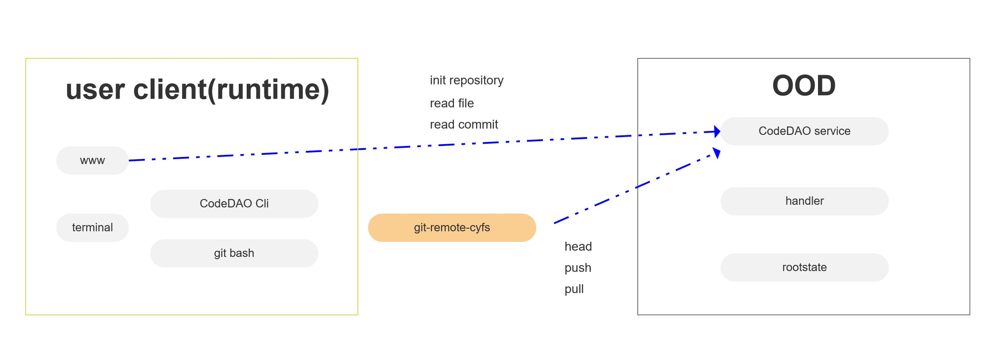

# CodeDAO

<p align="center">

</p>


[](https://opensource.org/licenses/BSD-2-Clause)
[](https://discord.gg/dXDxjXTEjT)

CodeDAO is a only fully decentralized code hosting platform in the world based on [cyfs protocol](https://github.com/buckyos/CYFS)

The vision of CodeDAO is to provide global developers a public and liberal platform, a platform that of the developers, by the developers, for the developers.

- Discord：https://discord.gg/dXDxjXTEjT
- CodeDAO White Paper(Coming soon)

# What CodeDAO provides to developers

- A fully decentralized git hosting platform
- Using DAO to operate open-source project
- Application DAO for the public platform
- A platform truly owned by developers

# How CodeDAO works

CodeDAO is built on CYFS, a next-generation Web3 infrastructure technology that completely decentralizes and frees the Web.

Currently, open source projects can only develop underlying tools used by Web2 companies, making it hard to change the world like free software once did and earn income. With CYFS, you can develop open source Web3 apps, directly developing products that can benefit the public and earn income.

# Full view of CodeDAO

<p align="center">

</p>

# Git push & pull process, and the rootstate path design
<p align="center">

</p>


# Status

The source code in the initial version

# Development

CodeDAO service written in rust, and the frontend written in tsx.
There are also a git-remote-helper component, which named `git-remote-cyfs` to tramsfor git object to web3 object(cyfs object)

(below develop guides part need to be replenish)

## Dec App

Ensure the cyfs service's gateway is running.
And in `src`

```
cargo build -p code-dao-service
```

## www
web3 entry ui

in `src/www`

```
npm install
npm run dev
```

## git-remote-cyfs

In the `src`

```
cargo build -p git-remote-cyfs
```

And copy the result(`target/debug/git-remote-cyfs`) to the excutable path of system.

# Directory Structure

```
├── docs // Document related
├── src // Project main folder
    ├── install // install git-remote-cyfs in windows
    ├── config // config file
    ├── cyfs-git-base // base lib
    ├── code-dao-service // code-dao service
    ├── square-service // square service
    ├── git-remote-cyfs
    ├── proto // service protobuf with rust
    ├── service-manager
    ├── testcase
    ├── Cargo.toml
    ├── www // Front-end project folder
        ├── 3rd
        |   ├──protoc //Object protobuf processing
        ├── .eslintignore // Configuration file to be ignored by eslint
        ├── .eslintrc.js // eslint configuration file
        ├── package.json // cyfs package and upload the dependent node library
        ├── prettier.config.js // prettier configuration file
        ├── readme.md // Description file
        ├── tsconfig.json // typescript configuration file
        ├── webpack.config.js // webpack configuration file
        ├── readme.md
        └── src
            ├── apis // interface file
            ├── assets // static resource file
            ├── components // component file
            ├── constants // constants file
            ├── i18n // internationalized language pack
            ├── stores // global state file
            ├── pages // page file
            ├── routers // routing files
            ├── styles // style file
            ├── types // types file
            └── utils // utility file
├── tools // Tool program folder, such as emulator program
```

# Run in zone-simulator

See docs/Run in zone-simulator.md

# TODOList

- [ ] consensus algorithm repositorys
- [ ] documentation improve
- [ ] friendly installer for git-remote-cyfs
