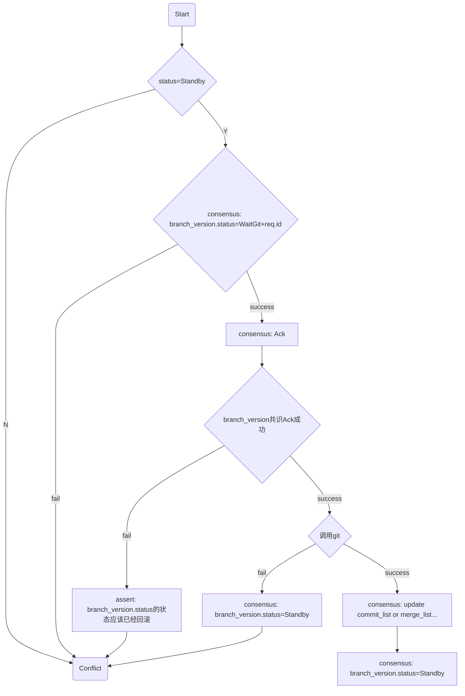

# 用户端

功能上，维护各用户自己的私有数据，我参与了哪些组织，哪些仓库，仓库具体状态数据...

技术上，维护下列数据:

| 信息                    | 是否共识 | 详述                                                                   |
| ----------------------- | -------- | ---------------------------------------------------------------------- |
| 组织列表                | 否       | 私有数据，个人参与了哪些组织                                           |
| 组织信息                | 是       | 单个组织的信息                                                         |
| 组织成员列表            | 是       | 各参与组织成员列表，该组织信息变更需要该列表中所有或者部分个体形成共识 |
| repo 列表               | 否       | 私有数据，个人参与/fork 的 repo 列表                                   |
| repo                    | 是       | 单个仓库的描述信息                                                     |
| repo.member_list        | 是       | 仓库参与者列表，该仓库的信息变更需要该列表中所有或者部分个体形成共识   |
| repo.member             | 是       | 一个仓库参与者                                                         |
| repo.branch_list        | 是       | 仓库分支列表                                                           |
| repo.branch             | 是       | 仓库一个分支信息                                                       |
| repo.branch_version     | 是       | 一个分支的版本信息                                                     |
| repo.branch.commit_list | 是       | 不同分支的提交列表可以并发执行，相同分支只能串行                       |
| repo.commit             | 是       | 一次提交                                                               |
| repo.branch.merge_list  | 是       | 不同分支的提交列表可以并发执行，相同分支只能串行                       |
| repo.merge              | 是       | 一次 merge                                                             |
| repo.stars              | 是       |                                                                        |
| repo.tree               | 是       | 这是啥，待设计                                                         |
| repo.issue_list         | 是       |                                                                        |
| repo.issue.issue        | 是       | 一个 issue 的信息                                                      |
| repo.issue.comment_list | 是       | issue 的评论列表                                                       |
| repo.issue.comment      | 是       | issue 的一条评论                                                       |

PS: 对于一种信息，参与共识的用户数据是一致的，这没有问题，其他只读用户，其本地信息只能作为`Cache`对待，应该从有共识权限的用户获取更新，原则上不做推送。

# 广场端

由`CodeDAO委员会`共同管理。

功能上，把各自仓库公开化，让其他用户可发现，访问，甚至参与，实现项目推广。

技术上，维护几个列表：

1. 公开仓库列表，记录其所有者(People 或组织)，不维护仓库本身内容
2. 组织列表，People 算一个只有一个人的组织
3. 各组织成员列表，每个组织维护一个列表

可能涉及到后期运营规划，待具体产品规划确定再安排；暂时继续采用中心化模式，但提供一个`Fake接口`实现，方便日后`DAO化迁移`。

# RootState 设计原则

列表集合类信息：单独设计一个纯粹的`Key`列表，具体内容另外存放，用来解共识嵌套

eg. 前述的分支，每个分支有个`name`作为`key`，它可以被提交从而产生变更。

直观逻辑上应该是下面的树形结构：

```
/repo
    |--branchs
        |--${branch.name}
            |--branch-->BranchInfo
            |--commits
                |--${commit.id}-->Commit
```

这里面`branchs`会因为拉分支被修改，`commits`会因为提交被修改，并且也会同步影响`branchs`的值；缘于去中心化的共识设计，要达成共识的状态节点至少应该在`branchs`，其下子树结构的任何修改都是串行的，而`提交`和`拉分支`是两个不相干的独立操作，不同分支上的提交也是可以并行的，所以把共识状态放到`branchs`不合适；强行使用上述结构，又想兼顾并行处理，只能设计更复杂的逻辑去同步这些状态。

按照前述原则，把列表的`Key`单独设计纯粹的列表封装，结构会变成如下所示:

```
/repo
    |--branch_list-->BranchList
    |--branchs
    |   |--${branch.name}
    |       |--info-->BranchInfo
    |       |--commit_list-->CommitList
    |--commits
        |--${commit.id}-->Commit
```

按照上面的设计，列表不会因为其下分支的内容变更而变更，我们可以分如下几个共识来并行处理不同的需求：

| 功能         | 共识状态                         | 辅助操作                                       |
| ------------ | -------------------------------- | ---------------------------------------------- |
| 拉分支       | branch_list                      | 在`branchs`下新增一项，但`branchs`本身无需共识 |
| 修改分支信息 | branchs[branch.name].info        |                                                |
| 提交         | branchs[branch.name].commit_list | 在`commits`下新增一项，但`commits`本身无需共识 |
| 修改提交     | commits[commit.name]             |                                                |

如上几个操作可以完全地实现不相关的并行处理；当然，上面的功能只用于示例，并不是实际需求，不必较真。

# 仓库维护

`Git`功能，除了维护`RootState`本身的数据结构外，还有附带的原生`Git`操作，它自己会有一些状态，理想状况下，把这些`Git`状态完全`CYFS`化是个好的选择，但之前调研过程中遇到不少问题，存在很大的不确定性，暂时考虑继续用`Git`状态作为缓存的策略。

这样带来`RootState`和`Git`两个不同系统的状态同步问题，考虑用状态机来解决：



注意:

1. `Ack`共识用来确保`branch_version.status`共识被二次确认，不会发生状态回滚，保障分支状态的不可重入;
2. 考虑到在状态机运行过程中因停电等不可控因素导致中止，应该选择时机(启动/按需)进行恢复。

# 管理员变更

    这里`管理员`指要参与共识的个体，不特指某特定场景`管理员`

1. 更新过程:

-   每个待共识状态都应该包括其管理员状态
-   旧管理员共识
-   新管理员同步相关信息

2. 对其权限内状态的影响
   每个`管理员`都有其管理的状态(由一个共识过程驱动)，状态变更的过程依赖`管理员`列表的内容；对于每个状态来说，在它的变更(正在执行共识)过程中，其`管理员`应该是确定的，所以`管理员`变更和状态变更本身的应用逻辑应该是串行关系。我们可以对这种普遍场景设计一致性解决方案，把`管理员`列表纳入状态的计算范围内。

我们把应用本身的状态记为`RawState`，把加入了`管理员`列表的状态记为`State`，最后对这种场景的共识状态的`RootState`设计如下:

```
/State
    |--raw-->RawState
    |--admins-->AdminList
```

基于以上的设计，我们应该配合做到两点:

1. 按需更新`admins`: 处于应用需求，需要修改`RawState`时，对比相应的`admins`和`管理员`当时的实时状态，如果不一致需要先提交更新`/State/admins`的共识，然后才提交修改`RawState`的共识
2. 实时更新`admins`: 在`管理员`发生变更后，对其权限内的所有状态提交`State/admins`变更共识；这是一个优化，非必须，可以提高 1 的执行速度，但不能替代 1，因为这个过程没有办法保证它能完整执行，起码可能发生停电事故

# 旧数据

`RootState`变更较大，而数据较少，考虑不做兼容升级处理，直接丢弃；当然可以考虑替用户做个备份，以待用户可以索回丢掉的代码。

# `DAO化`路线图

1. 共识框架，后面有几个没实现的想法，先加上
2. 用户端`DAO化`
    - 参照前面共识过程的划分，设计新的 RootState
    - 去掉第一次启动的用户初始化过程，用`PeopleId`替代旧的`User.name`，实现跨应用的账号一体化
    - 做第一个带共识的功能，积攒经验，并提高共识框架的易用性
    - 集中力量进行多产权改造
3. 广场端`Fake`实现

    参照`用户端`积累经验进行 DAO 化
